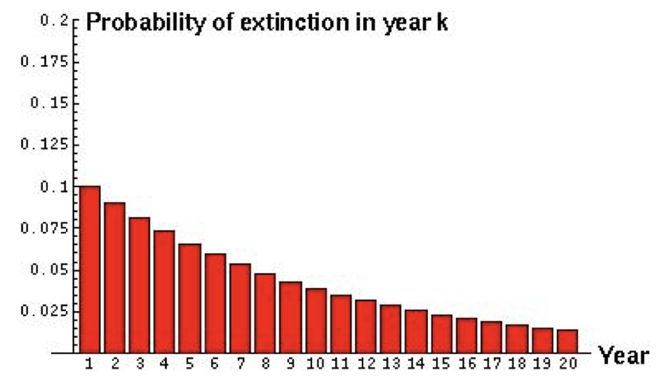
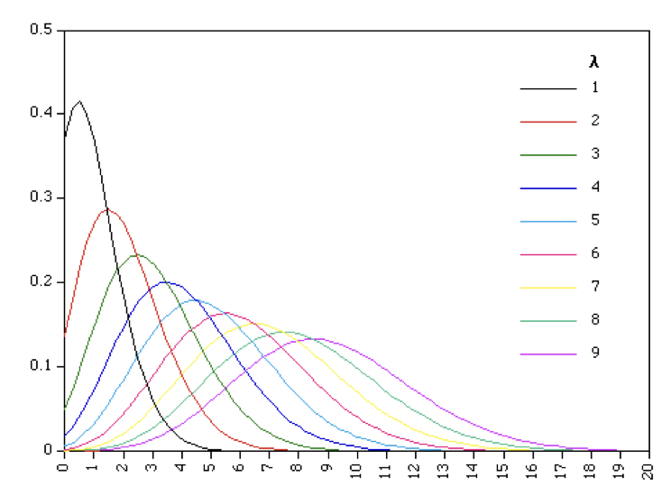
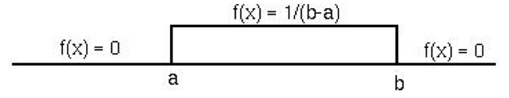
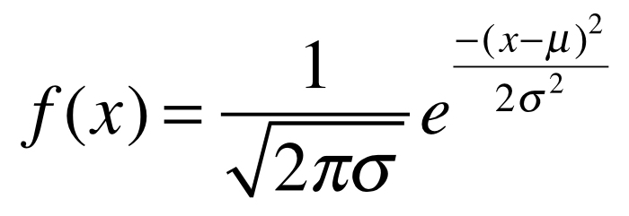

--- 
title: "Quantitative Genetics Graduate Education Module - Spring 2021"
author: "William A. Cresko"
date: "`r Sys.Date()`"
site: bookdown::bookdown_site
output: bookdown::gitbook
documentclass: book
bibliography: ["book.bib", "packages.bib"]
biblio-style: apalike
link-citations: yes
github-repo: rstudio/bookdown-demo
description: "This is the book of materials we will be using for the Quantitative Genetics GEM at the University of Oregon for the Spring Term of 2021"
---

# Course Overview

This is the complete set of _course materials_ for the _Quantitative Genetics Graduate Education Module (GEM)_ at the University of Oregon for the Spring of 2020. It is written in **Markdown** so that it can be easily updated. 

In book you will find nearly all the information you will need to complete the course.


```{r include=FALSE}
# automatically create a bib database for R packages
knitr::write_bib(c(
  .packages(), 'bookdown', 'knitr', 'rmarkdown'
), 'packages.bib')
```

<!--chapter:end:index.Rmd-->

# Introduction to the course

This is the main set of _course materials_ for the _Quantitative Genetics Graduate Education Module (GEM)_ at the University of Oregon for the Spring of 2021. It is written in **Markdown** so that it can be easily updated. 

In this book you will find nearly all the information you will need to complete the course.


## Instructor
Dr. Bill Cresko, wcresko@uoregon.edu


## Course Information
Virtual Class Hours: M-W-F 11 to 12 (Zoom)    
Virtual Office Hours: F 2 to 3 or by appointment (Zoom)    
https://uoregon.zoom.us/j/99789831102

## Software

- Latest version of R

- Latest version of RStudio

## Inclusion and Accessibility

Please tell me your preferred pronouns and/or name, especially if it differs from the class roster. I take seriously my responsibility to create inclusive learning environments. Please notify me if there are aspects of the instruction or design of this course that result in barriers to your participation! You are also encouraged to contact the Accessible Education Center in 164 Oregon Hall at 541-346-1155 or uoaec@uoregon.edu.

I am committed to making this course an inclusive and respectful learning space. Being respectful includes using preferred pronouns for your classmates. Your classmates come from a diverse set of backgrounds and experiences; please avoid assumptions or stereotypes, and aim for inclusivity. Let us know if there are classroom dynamics that impede your (or someone else’s) full engagement.

Because of the COVID-19 pandemic, this course is being delivered entirely remotely. I realize that this situation makes it difficult for some students to interact with the material, for a variety of reasons. I am committed to flexibility during this stressful time and emphasize that I will work with students to overcome difficult barriers as they arise.

<!--chapter:end:01-syllabus.Rmd-->

# Course Schedule

## Background Material

  - Introduction to quantitative genetics
  - Reading materials
  - Introduction to R and RMarkdown

## Heritability 

  - Genetic variation
  - Parent-offspring regression
  - Line means analysis
  - Environmental variation and trait distributions
  - Covariation among traits
  - The G-matrix

## Selection Analysis

  - Calculating fitness
  - Selection analysis
  - Correlation among traits
  - Normalization of traits
  - Calculation of selection gradients
  - Comparison of the pattern of selection across populations

## Quantitative Genetic Mapping

  - Basic phenotyping and mapping information
  - Quantitative Trait Loci (QTL) mapping
  - Epistasis
  - Genome Wide Association Studies (GWAS)


<!--chapter:end:02-schedule.Rmd-->

# Getting Started with R and Studio

## Introduction to R and RStudio

R is a core computational platform for statistical analysis. It was developed a number of years ago to create an open source environment for advanced computing in statistics and has since become the standard for statistical analysis in the field, replacing commercial packages like SAS and SPSS for the most part. Learning R is an essential part of becoming a scientist who is able to work at the cutting edge of statistical analysis -- or even to perform conventional statistical tests (e.g. a t-test) in a standard way. An important part of R is that it is script-based, which makes it easy to create reproducible analysis pipelines, which is an emerging feature of the open data/open analysis movement in science. This is becoming an important component of publication and sharing of research results, so being able to engage fully with this effort is something that all young scientists should do.

RMarkdown is an extra layer placed on top of R that makes it easy to integrate text explanations of what is going on, native R code/scripts, and R output all in one document. The final result can be put into a variety of forms, including webpages, pdf documents, Word documents, etc. Entire books are now written in RMarkdown and its relatives. It is a great way to make quick webpages, like this document, for instance. It is very easy to use and will be the format that I use to distribute your assignments to you and that you will use to turn in your assignments.

R Projects are a simple way of designating a working directory in which to house files related to a given, well, project. Those files might include primary data and metadata files ready for reading into R, `.R` scripts, Rmarkdown files, and output such as Rmarkdown-rendered .html files or individual plots, for example. The nice thing about organizing your work with R Projects is that you can keep everything needed to reproduce an analysis in a single directory on your computer. You can open an R Project in RStudio by opening the project's index (`.RProj`) file, which will automatically set your working directory to that of the project and facilitate loading any saved environments, etc.

In Chapter 6 we will begin working in R and RStudio, but you can get them installed now (in that order) on your computer, if you haven't already. Get the most recent *released* R version by following this link:

[https://www.r-project.org/](https://www.r-project.org/)

We will do our work using Rstudio, which is a powerful and convenient user interface for R, and can be downloaded from here for installation: [RStudio](https://rstudio.com/products/rstudio/)

### Learning resources

There are tons of resources for learning R and RMarkdown on the internet. Here are just a few, but you will no doubt find your own favorites as you become routine R users.

There is an organized group that is dedicated to training in R called DataCamp (https://www.datacamp.com/). They provide all of the basics for free. They actually have training for most data science platforms. RStudio provides links for training directly related to R and RMarkdown here: [RStudio Training](https://education.rstudio.com/)

There are also many, many R training videos on YouTube. Most of them are very well meaning but may not be as in-depth as you want. 

You can also go the old "paper" manual route by reading the materials provided by R itself: [R manual](https://cran.r-project.org/doc/manuals/r-release/R-intro.pdf)

In reality, if you want to do almost anything in R, simply type in what you are interested in doing into Google and include "in R" and a whole bunch of links telling you exactly what to do will magically appear. Most of them appear as discussions on websites like `StackOverflow` and `Stats.StackExchange`. In that case, the first thing that you see is the question--usually someone doing it just a bit wrong--so you should scroll down to see the right way to do it in the answers. It is really an amazing resource that will speed you along in nearly every form of analysis that you are interested in.

Please do not hesitate to contact us if you have questions or run into obstacles. The point of this class is to learn by doing, but our aim is that the doing should involve reasonable first efforts supplemented with help if needed. Also, many of your classmates have some experience with R, writing code, or statistics in general, so they are an excellent resource as well!

<!--chapter:end:03-background.Rmd-->

# Organizing and manipulating data files

## Introduction

Many of you will already be familiar with data file organizaiton, editing, and formatting for analysis. If so, much of the following material may be review. If not, some of the following guidelines and tools should prove to be quite useful. In biology, and many other fields, primary data are routinely stored as "flat" text files. The exact formatting depends on the type of data, of course, but often we are working with text files organized into rows and columns. Rows can naturally be defined by lines in a file, and columns can be defined by separators (also called delimiters) such as spaces, tabs, or commas, to name a few commonly used ones. Fortunately there are some very powerful and simple-to-use (with a little practice) tools that can be invoked directly from a computer's command line, or included in written "scripts" that your computer's operating system can interpret upon you running them. These command line tools are now nearly ubiquitous on all personal computer platforms. Computers running a LINUX operating system allow direct access to these tools via the command line, as does the macOS operating system of Apple computers via the Terminal. Computers running Microsoft Windows 10 now also facilitate use of these conventional "UNIX tools" through a Windows Subsystem for Linux.

In the following sections, we provide a *very brief* introduction to using some of these tools in order to organize your data files, parse them for information, and perform some basic text manipulations. Mastering these activities is not necessary for this course (in fact, many of the text manipulation tasks can be done in R!), but if you learn to adopt at least some of these skills you will become a better, more organized analyst, and it will help you become comfortable with the command line and programming in general. 


## Navigating file systems from the command line

### Access to the command line

The first step to using command line tools is to get access to the command line! On Mac and Linux systems you can simply do this by finding and opening the `Terminal` application. On Windows 10 systems, you'll have to install a Linux Bash Shell if you haven't already. To do this you will need to follow the instructions here: https://itsfoss.com/install-bash-on-windows/
When you get to the point of choosing the Linux distribution to install, I recommend Ubuntu.

At this point you should have command line access through a terminal prompt, which should look something like my Mac Terminal below:
/06.Teaching/15.Evolutionary_Genomics_GEMs/04.Quantitative_Genetics_CRESKO/UO_Quant_Gen_Text/images/MacTerminal.png)

You are now ready to navigate and explore files simply by typing!

### Navigating directories and files

When you are at the command line, just think of your computer as you would if you were navigating using a graphical application (e.g. Mac Finder or Windows Explorer). You are always in a directory in your file system, and you can move to any other directory by typing the appropriate command and destination, then hitting Enter.

The first crucial UNIX command to learn is `pwd`. This command stands for "print working directory," and it will literally print the path of the directory you are currently in.

Another important command is `ls`. This lists the files and directories (by default) in your working directory. If you specify a different directory, it will list the files and/or directories there. Most UNIX commands (and indeed command-line programs in general), can be run with options. One way to invoke an option is to type a "flag" along with the command. In the case of `ls`, we can type `ls -l`, for example, which will print the output line-by-line. We can also add another flag: `ls -lh` (equivalent to `ls -l -h`), which will print items line-by-line but also make sure the item sizes are "human readable." If you ever have questions about how to use a UNIX program, including the flags and other options, you can type `man program_name` and a wonderful help manual will appear. To exit and return to the command prompt, just hit "q". These `man` pages are extremely useful and should be your first go-to if you need information for a particular command. Please use these regularly!

The command `cd` will change your location from the current directory to another directory. Like many other programs (UNIX and otherwise) requiring you to input directory and file locations, with `cd` you can specify your desired location using either the *absolute* or *relative* path. An absolute path is the full "address" of a directory or file, starting from the root of your file system. An example of an absolute path to a directory in my file system is `/Users/csmall/Dropbox/sculpin_project/images/`. Regardless of where my current working directory is in my file system, I can change to this `images/` directory using `cd` and the full path. I can also use a relative path, which is a sort of "shortcut," to specify the location of a directory or file. Let's say I am in `/Users/csmall/Dropbox/BiostatsFound_S2020/` and I want to get to the `images/` directory above. I could type `cd ../sculpin_project/images`, which uses a relative path to take me "up" one directory (as denoted by `../`) into `Dropbox/` and back "down" into `sculpin_project/images`. In fact, `..` is a special file in every directory that just means "the directory above." The special file `.` is the current directory. And to mention one final useful designation for navigation shortcuts, you can use the `~` to denote your home directory.

The schematic below should help you visualize how to think about file system navigation from the commmand line:
/06.Teaching/15.Evolutionary_Genomics_GEMs/04.Quantitative_Genetics_CRESKO/UO_Quant_Gen_Text/images/Directory_example.jpeg)

And for another example, take a look at this series of navigation commands from my terminal and see if you can follow along:
/06.Teaching/15.Evolutionary_Genomics_GEMs/04.Quantitative_Genetics_CRESKO/UO_Quant_Gen_Text/images/MacTerminal_2.png)

If you want to create a new directory, you can use the `mkdir` command, including the desired name of the new directory. By default this will create the directory in your current working directory, but you can use absolute or relative paths to instead write the directory somewhere else. If you want to delete an empty directory, `rmdir` is the appropriate command. 

Now let's briefly cover some UNIX commands that are useful for managing files. Some of these apply to directories as well, which I will point out as we go. The command `touch` can be used to create a new, empty file, which you can add to using a plain text editor. Examples of popular plain text editors with advanced user interfaces are BBEdit and Atom. You can also use command line text editors, such as `nano`, `emacs`, and `vim`. Most UNIX/LINUX systems have `nano` installed by default. To copy or change the name and/or location of a file (or directory), use `cp` and `mv` commands, respectively. Note that by using absolute or relative paths, you can specify where you want the file or directory to end up. Be especially careful with these, however, because you will overwrite any existing file or directory if you specify the same name and location. Another command you should be extremely cautious with is `rm`, which removes (permanently deletes) a file. `rm -r` can be used to delete a non-empty directory AND all of its contents.

In many cases you will want to look at files, or parts of them at least, from the command line. `cat` will print the entire contents of a file, but can also be used to combine ("concatenate") multiple files in a line-wise manner. `less` and `more` will display specific lines of a file (starting with the first ones), with single- or multi-line "scrolling," respectively, activated using the return or down-arrow keys. To leave the display, you need to hit the "q" key. `head` and `tail` will display the first or last, respectively, *n* lines of the file, where *n* is provided as a flag (e.g. `head -200 file.tsv`). The "word count" command `wc` can quantify elements of a text file in various ways, but one common application is `wc -l`, which counts the number of lines in a file.

An aside: If you are working from the command line and want to terminate a process (say you accidentally start a task that will take way too long), press Ctrl-C.

#### A quick review of important UNIX commands for navigation and viewing

`pwd` - prints working directory

`ls` - lists contents of a directory

`cd` - changes the working directory

`mkdir` - creates a new directory

`rmdir` - deletes an empty directory

`touch` - creates an empty file

`cp` - copies a file or directory

`mv` - changes the name of a file or directory

`rm` - deletes a file, or a directory and everything inside with `-r`

`cat` - prints the entire file to the terminal, or concatenates and prints multiple files

`less` - displays the first lines of a file, with scrolling line-by-line

`head` - prints the first 10 lines (default) of a file

`tail` - prints the last 10 lines (default) of a file

`wc -l` - prints the number of lines in a file

### Useful UNIX commands for file manipulation

In many cases you will want to search for specific characters or combinations of characters, and do various things with that information. Maybe you want to isolate the lines of a file that contain the query, or perhaps you want to count how many lines contain the query. The tool `grep` is extremely useful in this regard. We don't have time for a comprehensive dive into the utilities of `grep`, but a few common applications are worth mentioning. Character patterns we search for using `grep` may or may not involve special characters that are not interpreted literally. Here we will discuss just a few common cases of `grep` searches and the special characters involved. Some examples of these special characters include `^` (beginning of a line), `$` (end of a line), `.` (any single character except a newline), `*` (zero or more instances of the preceding character), and `\s` (any white space). The standard syntax for `grep` from the command line is `grep "expression" filename`. So, if you wanted to return all of the lines in the data file `zfish_data.tsv` (assuming it is in the current directory) that begin with "embryo_10", you could try ```grep "^embryo_10" zfish_data.tsv```. This search would also (unintentionally) find lines beginning with "embryo_100" or "embryo_101", etc., if they exist. So, you have to be careful, and learning the rules just takes practice. In this case ```grep "^embryo_10\s" zfish_data.tsv``` would achieve the desired result, assuming that there is a whitespace delimiter between fields ("columns") in the data file. Useful flags for `grep` include `-c` (which counts the number of lines containing the query), `-v` (which returns the lines that _do not_ contain the query), and `-n` (which prints the line number for each line containing the query). I encourage you to look at many different `grep` use cases online as your demand for complex searches grows.

The program `sed` has reasonably complex applications, but is commonly used as a sort of "search and replace" tool. The syntax for `sed` use is similar to `grep`, except that the query and replacement expressions are organized (with other information) using slashes. For "search and replace" functionality, that syntax looks like this: ```sed 's/query/replacement/flag' filename```. One common option for the "flag" component is "g", meaning "global", which replaces all instances. If no flag designation is made only the first instance in the file is replaced. Building on our toy example from above, ```sed 's/^embryo_/^larva_/g' zfish_data.tsv``` would perform a global replacement and print the output to the terminal. To change the contents in the original file on the fly, including `sed -i` would do the trick, but is riskier than redirecting the output to a new file.

`cut` is quite straightforward, and can be used to isolate individual fields (think of them like "columns") from a text file, provided the fields are consistently separated by a delimiter on each line. So, if I had a comma-separated file and I just wanted the first two columns I could type ```cut -f1,2 -d"\t" filename```. Note that if you don't specify a delimiter using the `-d` flag, then it is assumed to be tab-delimited. If you want to bring together fields in separate files, `join` can be used to accomplish this. The two files should have equivalent rows, however, for this action to work properly.

If you want to sort text files alphanumerically, in a field-wise fashion, `sort` is quite useful. If a file contains a single field, minimal specification is required, aside from tuning numerical sorting. For example, if you want to sort numerically, use the `-n` flag, and if you want to sort from largest to smallest, add the `-r` flag. If you want to sort a multi-field file based on just one field, you can use the "key" flag. For instance, if you have a tab-delimited file and want to sort by the second field in reverse numerical order, ```sort -k2,2 -nr filename.tsv``` would give you the desired result. Finally, if you want to eliminate lines with the same value for a given field, you can use the `-u` "unique" flag.

The UNIX program `awk` is an extremely powerful tool, and can itself be used essentially as a mini programming language. We will not get into the myriad uses of `awk` here, but the reference at the bottom of the chapter is a great resource if you want to learn more. `awk` is extremely efficient at parsing and capturing text files in a column-wise manner, with the ability to also evaluate logical statements applied to rows. The structure of `awk` commands is more complex than that of other UNIX programs we have discussed, but it is still very intuitive. One unique feature is that `awk` contains its own internal functions, which are typed inside curly braces. The "print" function can be used to extract fields, much like `cut`. For instance, ```awk -F: '{print $1,$6}' filename.tsv``` would print the first and sixth field from `filename.tsv`, assuming a ":" delimiter. With `awk`, fields are specified using the `$` character. If you want also to select only specific rows from a set of columns (like those with a certain value), you can incorporate logical operators. In the above example if we had wanted fields 1 and 6, but only those rows with a value of at least 610 in field 4, we could type the following ```awk -F: '$4 >= 610 {print $1,$6}' filename.tsv```. Again, this is just scratching the surface with `awk`, which boasts a great deal of potential for your text file manipulation needs.


#### A quick review of key UNIX commands for text file searching and manipulation

`grep` - searches a file for characters and character combinations

`sed` - stream edits characters and character combinations

`cut` - isolates specific fields ("columns") from a file using a delimiter

`join` - combines fields ("columns") from multiple files with equivalent rows

`sort` - orders the rows in a file based on one or more fields

`awk` - flexibly parses, evaluates, and selectively prints row- and column-wise 

### A quick word on pipes and carrots

One very convenient feature of UNIX commands is that you can control the flow of input and output from one command to another using the `|` ("pipe") character. For instance, I may want to search an entire file for rows that begin with "fish-1", and then replace the "-" with "\_". To do this I could do something like ```cat file.tsv | grep "^fish-1" | sed 's/fish-1/fish_1/g'``` This, of course, would print the output to the terminal, but I could actually capture that output into a file using the `>` character. ```cat filename | grep "^fish-1" | sed 's/fish-1/fish_1/g' > ./newfile.tsv``` would write this new file to my current working directory. Furthermore, if you want to append lines of text to an existing file, the "double sideways right-pointing carrot" character `>>` can be used.

The above lessons on UNIX commands for file manipulation truly just scratch the surface of what can be accomplished at the command line and in "shell scripts." You certainly will have further questions and be hungry for more, but we simply don't have time during this course. But to work on your UNIX skills for now, check out `Ex1_Unix_Intro.html` (on Canvas). We need to move on to R now, but at the bottom of this chapter are some UNIX command resources I have found to be especially useful.

## Data file and data file entry dos and don'ts

Do store a copy of your data in a nonproprietary format, such as plain ASCII text (aka a flat file). This is especially important if you are using tools (like UNIX commands) to parse and manipulate the files. Formats like Microsoft Excel are not acceptable as input for many analysis tools, and not everyone has access to proprietary software.

Do leave an un-edited copy of an original data file, even when main analyses require an edited version.

Do use descriptive names for your data files and variables, and use them consistently!

Do maintain effective metadata about the data.

Do add new observations to a data file as rows.

Do add new variables to a data file as columns.

Don't include multiple data types in the same column.

Don't use non-alphanumeric characters (other than the underscore) in file or directory names.

Don't use spaces, tabs, commas, colons, semicolons, or other characters commonly used as field (column) delimiters in names of individual data entries. For example, don't use something like `March 8` as a value for date in a data set.

Don't copy and paste data directly from rich-text-formatted files (like Microsoft Word) into primary data files.


## Exercises associated with this chapter:

- Exercise 1 (file: `Ex1_Unix_Intro.html`)

## Additional learning resources

- http://mally.stanford.edu/~sr/computing/basic-unix.html - A nice "cheat sheet"

- http://korflab.ucdavis.edu/Unix_and_Perl/ - Outstanding tutorial by Keith Bradnam and Ian Korf

- https://www.datacamp.com/courses/introduction-to-shell-for-data-science - DataCamp tutorial

- https://www.gnu.org/software/gawk/manual/gawk.html - A comprehensive guide to `awk`

<!--chapter:end:04-data_organization.Rmd-->

# An Introduction to the R language

## Background

`R` is a computer programming language and environment especially useful for graphic visualization and statistical analysis of data. It is an offshoot of a language developed in 1976 at Bell Laboratories called `S`. `R` is an interpreted language, meaning that every time code is run it must be translated to machine language by the `R` interpreter, as opposed to being compiled prior to running. `R` is the premier computational platform for statistical analysis thanks to its GNU open-source status and countless packages contributed by diverse members of the scientific community.

## Why use `R`?

- Good general scripting tool for statistics and mathematics
- Powerful and flexible and free
- Runs on all computer platforms 
- New packages released all the time
- Superb data management & graphics capabilities
- Reproducibility - can keep your scripts to see exactly what was done
- Can embed your `R` analyses in dynamic, polished files using R markdown
- You can write your own functions 
- Lots of online help available
- Can use a nice IDE such as `RStudio`

## Important `R` terms and definitions

/06.Teaching/15.Evolutionary_Genomics_GEMs/04.Quantitative_Genetics_CRESKO/UO_Quant_Gen_Text/images/R_definitions_Logan.001.jpeg)

---

Operators are symbols in programming that have a specific meaning

/06.Teaching/15.Evolutionary_Genomics_GEMs/04.Quantitative_Genetics_CRESKO/UO_Quant_Gen_Text/images/R_definitions_Logan.002.jpeg)

---

## Getting started with `R` via the RStudio Environment

To begin working with `R`, open RStudio. You should first see something that looks like this:
/06.Teaching/15.Evolutionary_Genomics_GEMs/04.Quantitative_Genetics_CRESKO/UO_Quant_Gen_Text/images/MacTerminal_3.png)

To open a new script editor (where you will keep track of your code and notes), go to File > New File > R Script. Note that there are other options for file types, which we will be using in the future. For now, though, we want a plain script, which when saved will have the extention `.R`.

It is easy to run code directly from the script editor. For single lines of code, simply make sure your cursor is on that line, and hit Ctrl-Enter. For multiple lines, highlight the block of code you want to run and hit Ctrl-Enter.

Now your display should look somehting like below (but without the red pane labels, of course):
/06.Teaching/15.Evolutionary_Genomics_GEMs/04.Quantitative_Genetics_CRESKO/UO_Quant_Gen_Text/images/R_definitions_Logan.003.jpeg)

Note that you can also type commands directly from the command line using the `R` Console (lower left pane), and the `R` interpreter will run them when you press Enter.

Any objects you define, and a summary of their values, will appear in the upper right pane, and the lower right pane differs in appearance depending on instructions you provide to `R Studio`. For instance, if you produce a plot, it will appear there by default. Another extremely important feature of R functions (we'll get to them in a bit) is the help file. Recall from Chapter 5 our discussion of `man` pages for UNIX programs. Help files the equivalent for `R` functions. They contain almost everything you need to know about a given function, and most of them even include and example at the bottom. These help files will appear in the lower right RStudio pane when you call them, for example when you run `help(function_name)` at the `R` Console.

### R Programming Basics

For the code examples below, it might be useful for you to start your own RStudio session, open a new `.R` file and type/run code while reading.

- Commands can be submitted through the terminal, console or scripts
- In your scripts, anything that follows `#` symbol (aka hash) is just for humans
- Notice on these slides I'm evaluating the code chunks and showing output
- The output is shown here after the two `#` symbols and the number of output items is in `[]`
- Also notice that `R` follows the normal priority of mathematical evaluation


```{r basic multiplication, echo=TRUE}
4*4
```

```{r more multiplication, echo=TRUE}
(4+3*2^2)
```

#### A note on `R` Markdown

This format provides a much better way to embed code and output, in an easily readable, reproducible manner. We will dive into `R` Markdown next week, so for now just be aware that it exists.

- http://kbroman.org/knitr_knutshell/pages/Rmarkdown.html

- You can insert `R` chunks into `Rmarkdown` documents

#### Assigning Variables

- To "store" information for later use, like the arithmetic operation above, we can assign variables in `R`.

- Variables are assigned values using the `<-` operator.

- Variable names must begin with a letter, and should not contain spaces or `R` operators (see above) but other than that, just about anything goes. It is good practice to avoid periods in variable names, as they have other functionality in related programming languages, like Python. 

- Do keep in mind that `R` is case sensitive.

```{r assigning variables, echo=TRUE, tidy=TRUE}

x <- 2
x*3
y <- x * 3
y-2

```

These do not work

```{r eval=FALSE, echo=TRUE}
3y <- 3
3*y <- 3
```

#### Arithmetic operations with functions

- Arithmetic operations can be used with functions as well as numbers.

- Try the following, and then your own.

```{r functions, eval = FALSE, echo = TRUE}
x+2
x^2
log(x) + log(x+1)
```

- Note that the last of these - `log()` - is a built in function of `R`, and therefore the argument for the function (in this case "x" or "x+1") needs to be put in parentheses.

- These parentheses will be important, and we'll come back to them later when we add other arguments after the object in the parentheses.  

- The outcome of calculations can be assigned to new variables as well, and the results can be checked using the `print()` function.

```{r, echo=TRUE}
y <- 67
print(y)

x <- 124
z <- (x*y)^2
print(z)
```

#### Strings

- Assignments and operations can be performed on characters as well.
- Note that characters need to be set off by quotation marks to differentiate them from numeric objects.

- The c(function) stands for 'concatenate'.
- Note that we are using the same variable names as we did previously, which means that we're overwriting our previous assignment.

- A good general rule is to use new names for each variable, and make them short but still descriptive

```{r, echo=TRUE}
x <- "I Love"
print (x)
y <- "Biostatistics"
print (y)
z <- c(x,y)
print (z)
```

The variable z is now a vector of character objects.

#### Factors

- Sometimes we would like to treat character objects as if they were units for subsequent calculations.

- These are called factors, and we can redefine our character object as one of class factor.

- This might seem a bit strange, but it’s important for statistical analyses where we might want to calculate the mean or variance for two different treatments. In that case the two different treatments would be coded as two different "levels" of a factor we designate in our metadata. This will become clear when we get into hypothesis testing in `R`.

```{r, eval = FALSE, echo = TRUE}
z_factor <- as.factor(z)
print(z_factor)
class(z_factor)
```

Note that factor levels are reported alphabetically. I used the `class()` function to ask `R` what type of object "z_factor" is. `class()` is one of the most important tools at your disposal. Often times you can debug your code simply by changing the class of an object. Because functions are written to work with specific classes, changing the class of a given object is crucial in many cases.

#### Null values

- R (and many programming languages) have special strings that mean 'no value', or 'null'. In R, the most common is `NA`, although there are others as well (`NULL` and `NaN`) 

- Typically, `NA` is used to indicate a lack of data for a given observation, or a missing value where there normally should be one. 

- Any instance of a blank entry in your data file will be read into R as an `NA`. 

- NA is a technically a logical data type, and is *not* equivalent to an empty string or the numeric 0. It is also a reserved word and can't be used as a variable name. 

```{r, echo = TRUE}
class(NA)
```

Many functions in R (e.g. `mean()`) will not work by default if passed any NA values as an argument. So if we want to determine the mean of a vector of numeric values, we need to ensure there are either no NA values in the vector, or specify an additional 'argument' to the function telling it to ignore `NA`. Additionally `NA`, like other 'null' values, are operated on by a number of unique functions in R.

```{r, echo = TRUE}
num <- c(0,1,2,NA,4)
mean(num)
mean(num, na.rm = TRUE)
is.na(num)
```

#### Vectors

- In general R thinks in terms of vectors (a list of characters factors or numerical values) and it will benefit any R user to try to write programs with that in mind.

- The simplest vectors in R are 'atomic' vectors, meaning that they consist of only one data type. 

- R operations, and therefore functions, are vectorized.

- This means an operation or function will be performed for each element in a vector.

- Vectors can be assigned directly using the 'c()' function and then entering the exact values.

```{r Example vectors, echo=TRUE}
x <- c(2,3,4,2,1,2,4,5,10,8,9)
print(x)
x_plus <- x+1
print(x_plus)
```

- Creating vectors of new data by entering it by hand can be a drag.

- However, it is also very easy to use functions such as `seq()` and `sample()`.

- Try the examples below. Can you figure out what the three arguments in the parentheses mean?

- Within reason, try varying the arguments to see what happens


```{r, echo = TRUE}
seq_1 <- seq(0.0, 10.0, by = 0.1)
print(seq_1)
seq_2 <- seq(10.0, 0.0, by = -0.1)
print(seq_2)
```


```{r, echo = TRUE}
seq_square <- (seq_2)*(seq_2)
print(seq_square)
```


```{r, echo = TRUE}
seq_square_new <- (seq_2)^2
print(seq_square_new)
```


- Here is a way to create your own data sets that are random samples.

- Again, on your own, play around with the arguments in the parentheses to see what happens.


```{r Samples from distributions 1, out.width='100%', echo = TRUE}
x <- rnorm (10000, 0, 10)
y <- sample (1:10000, 10000, replace = T)
xy <- cbind(x,y)
plot(x,y) 
```

- You’ve probably figured out that "y" from the last example is a draw of numbers with equal probability (what we call a flat, or uniform distribution).

- What if you want to draw from a defined probability distribution, like the normal distribution?

- Again, play around with the arguments in the parentheses to see what happens.

```{r Samples from distributions 2, out.width='100%', echo = TRUE}
x <-rnorm(100, 0, 100)
print (x)
hist(x, xlim = c(-50,50))
hist(x, xlim = c(-500,500))
```

Can you figure out what the three rnorm() arguments represent?


#### Basic Summary Statistics

We will get into the details regarding summary statistics later, but for now, check out several of the `R` functions that calculate them.

```{r, eval = FALSE, echo = TRUE}
mean(x)
median(x)
var(x)
log(x)
ln(x)
sqrt(x)
sum(x)
length(x)
sample(x, replace = T)
```

- Notice that the last function (`sample`) has an argument (`replace=T`)

- Arguments simply modify or direct the function in some way

- There are many arguments for each function, some of which are defaults

#### Getting help to understand functions

- Getting help on any function is very easy - just type a question mark and the name of the function.

- There are functions for just about anything within `R` and it is easy enough to write your own functions if none already exist to do what you want to do.

- In general, function calls have a simple structure: a function name, a set of parentheses and an optional set of arguments you assign parameters to and send to the function.

- Help pages exist for all functions that, at a minimum, explain what parameters exist for the function.

- Help can be accessed a few ways - try them :

```{r, eval = FALSE, echo = TRUE}
- help(mean)
- ?mean
- example(mean)
- help.search("mean")
- apropos("mean")
- args(mean)
```


## Additional learning resources:

- Logan, M. 2010. Biostatistical Design and Analysis Using R. - A great intro to R for statistical analysis

- http://library.open.oregonstate.edu/computationalbiology/ - O’Neil, S.T. 2017. A Primer for Computational Biology

<!--chapter:end:05-R_introduction.Rmd-->

# More R Functions, Complex Objects, Basic Plotting, and RMarkdown

## Background

In this chapter we will cover a variety of topics, all of which will help you build your `R` programming skills and make you capable of dealing with data sets using `R`. We will explore additional base `R` functions that are extremely useful for generating and manipulating vectors, combining vectors into multidimensional `R` objects, and working with those objects. We will also cover base `R` plotting functions to get you started with making your own publication-quality plots. Finally, we will touch on the RMarkdown file format, how to write those files in `RStudio`, and how to render the `.Rmd` file into polished, readable `.html` documents.


## More on functions

In the last chapter we touched on functions in `R`, gave a few examples of commonly used functions, and covered how to learn more about a function using the `help()` function. As mentioned, functions and their use follow a basic structure. To call functions we type their name and include a set of parameters expressed as arguments, which specify what we want them to do, inside parentheses `()`. For example, to successfully call the function `mean()`, we need, at minimum, to supply a vector of numeric values. That vector can be an obect we have already assigned in our environment, or it can be the outcome of another function called within the `mean()` function. Below are these two alternatives.

```{r, echo=TRUE}
z <- c(10, 20, 30)
mean(z)

mean(c(10, 20, 30))
```

The second alternative illustrates the power of "nesting" functions within `R`. You don't need to perform tasks by defining a bunch of intermediate objects and calling functions in piecemeal manner. In many cases it is much more efficient to nest functions within one another, as long as it doesn't jeopardize the functionality or readability of your code.

Base `R` includes dozens of useful functions that will become part of your regular arsenal. We have already mentioned several of these and discussed how to discover and learn more about them. As you become a more advanced `R` user, and in particular as you begin performing tasks and analyses more specific to your field of study, you will need to use functions that are not included in the base `R` library. Fortunately, there are thousands of functions distributed in the form of `R` "packages," which you can easily install on your system. Packages especially easy to find and use are those distributed via the Comprehensive R Archive Network (CRAN): https://cran.r-project.org/web/packages/index.html. If you find a specific function or set of functions you are interested in trying out, for instance after a Google search of your problem, you can download and install the package those functions belong to by running the following command from your `R` Console:

```{r eval=FALSE, echo=TRUE}
install.packages("name_of_package")
```

Note that the name of the package has to be spelled correctly (and `R` is case sensitive), and that the name of the package should be in quotation marks. You will get a series of messages printed to the Console, and finally either a confirmation of installation or error message. Once you have installed a package successfully, you do not need to re-run the `install.packages()` function. If you want to check whether a package has already been installed, and look at the details of that installation, you can always run the following from the Console:

```{r eval=FALSE, echo=TRUE}
installed.packages("name_of_package")
```

To actually use the functions from an installed package, you have to "load" that package into your current working environment. To do that we use the `library()` function:

```{r eval=FALSE, echo=TRUE}
library(name_of_package)
```

Note that you do not include quotation marks around the package name for the `library()` function. Unlike package installation, you will need to invoke `library()` every time you start a new `R` session to load the package and its functions.

It is also possible, and quite straightforward, to write your own `R` functions, which you can define within your `.R` or `.Rmd` scripts for convenient usage. If you get the the point at which you want to distribute your own functions in the form of a package, that is possible too. Later during this course we will get a little experience in writing simple `R` functions. Writing more involved functions and publishing packages, however, are topics for a more advanced `R` course.

### More base `R` functions useful for working with vectors

Below are annotated lists of base `R` functions commonly used to work with vectors. We will not take the time here to give specific examples for each function, because their usage is quite straightforward and you will get plenty of practice with them in associated exercies. You can also practice using the `help()` function if you have specific questions.


**The following functions provide information about vectors:**

- `head()`: returns the first elements of an object (like a vector or data frame)

- `tail()`: returns the last elements of an object (like a vector or data frame)

- `length()`: returns the number of elements in a vector

- `class()`: returns the class of elements in a vector (e.g. "character", "numeric", "factor", etc.)


**The following functions can modify or generate vectors in structured ways:**

- `sort()`: returns a sorted vector from an orignal vector of numeric values

- `seq()`: returns a "series" of numeric values beginning at one value and ending at another, while also specifying the size of increments/decrements between values

- `rep()`: returns a vector of identical elements, repeated a specified number of times

```{r, echo=TRUE}
rep(1, 5)
rep("one", 5)
```

Note that `seq()` and `rep()` can be repeated and/or combined in various ways, in some cases using `c()`, to generate vectors in a multitude of patterned ways.  


**The following functions can generate vectors of random values, randomly shuffle vectors, or generate vectors of values drawn from defined probability distributions:**

- `sample()`: randomly selects and returns elements from a vector ("shuffles" a vector when size argument is set to original vector size and replace argument is set to "FALSE")

- `rnorm()`: randomly draws values from a theoretical normal distribution

- `rbinom()`: randomly draws values from a theoretical binomial distribution

- `set.seed()`: sets `R`'s random number generator seed so that operations with stochastic properties can be reproduced 


**The following functions can change the class of elements in a particular vector:**

- `as.numeric()`: changes the class of objects in a vector to "numeric".

- `as.factor()`: changes the class of objects in a vector to "factor".

- `as.character()`: changes the class of objects in a vector to "character".

The `as.xxx` family of `R` functions is especially useful if you need to convert the class of a particular object for a given function to use the object properly.


## Indexing vectors

Now that we are quite familiar with different ways for generating vectors, let's discuss how we isolate specific elements from those vectors. This process is called "indexing," and in `R` simple numeric (or "positional") indexing is intuitively based on integers, starting from "1". We use the square braces for numeric indexing in `R`: `[]`. For example if we want to index the first element in a vector, we simply type `[1]` after the vector. Indexing can be performed on a defined vector, or on the fly using the immediate output of a function call.

```{r, echo=TRUE}
## Using our vector z from above
z[1]

## On the fly using output from the c() function
c(10, 20, 30)[1]
```


To isolate a series of consecutive elements from a vector, we simply use the `:` character. For example, if we want to index the first (or last) 4 elements from the vector below we could do this, respectively:

```{r, echo=TRUE}
c(10, 20, 30, 40, 50, 100, 200)[1:4]

c(10, 20, 30, 40, 50, 100, 200)[4:7]
```


For indexing discontinuous elements, we can use our old friend, the `c()` function inside of the square braces. So, if we want to index the first 3 and the 5th elements:

```{r, echo=TRUE}
c(10, 20, 30, 40, 50, 100, 200)[c(1:3, 5)]
```


Finally, we can use the `-` character to index all elements of a vector, "minus" other elements. When excluding even consecutive elements, however, we have to include `c()`. For instance, if we want all **except** the first 2 elements, we could do:

```{r, echo=TRUE}
c(10, 20, 30, 40, 50, 100, 200)[-c(1:2)]
```


## More complex data objects in `R`

Vectors are extremely important object types in `R`, for the reasons and examples we have already discussed. Other types of objects in `R` are also important, and necessary to learn about to do meaningful and efficient work. These other types of objects are more complex than vectors, but they can, in many cases, be composed of vectors.


### Lists

Lists in `R` are aggregates of different objects, and those objects can be a mixed variety of types. For example, a list could be an aggregate of 3 different vectors, even if those vectors are different lengths and contain elements of a different class. We can generate lists using the `list()` function.

```{r, echo=TRUE}
vec1 <- c(10, 20, 30, 40, 50, 100, 200)
vec2 <- c("happy", "sad", "grumpy")
vec3 <- factor(c("high", "low"))

mylist <- list(vec1, vec2, vec3)

print(mylist)

class(mylist)

str(mylist)
```

Let's take note of a few things from the output above. First, notice that each of the three vectors in `mylist` has a numeric (positional) index. Unlike individual vectors, however, primary elements of lists are indexed by double square braces `[[]]`. So, if we want to index the `vec2` element of `mylist`, we type:

```{r, echo=TRUE}
mylist[[2]]
```

Taking it one step further, if we want to index the 2nd element of the `vec2` element of `mylist`, we type:

```{r, echo=TRUE}
mylist[[2]][2]
```

The other things we should note from our exploration of `mylist` above is that 1. It has a class when we call the `class()` function, and 2. We see a nice breakdown of the 3 components that make up `mylist` when we call the `str()` function. `str()`, which is short for "structure," is an especially useful function for trying to understand the organization of complex objects in `R`.


### Data frames

There is a special class of list we very often work with in `R` called a "data frame." You can think of data frames as an especially useful organizing structure for data sets. Data frames are lists of vectors, but the vectors have to be the same length. Also, the vectors (officially known as "columns") in data frames have names we refer to as "column names," and the rows also have names. For the types of analysis we will be dealing with in this course, it helps to organize our data so that variables in our study correspond to columns and observations correspond to rows. Let's explore some practical details regarding the generation and use of data frames.


#### Creating data frames in `R`

We can generate data frames manually, like we did with the list `mylist` above. Here, for example, we can set up three variables (habitat, temp and elevation) as vectors.

```{r, echo=TRUE}
habitat <- factor(c("mixed", "wet", "wet", "wet", "dry", "dry", "dry","mixed"))
temp <- c(3.4, 3.4, 8.4, 3, 5.6, 8.1, 8.3, 4.5)
elevation <- c(0, 9.2, 3.8, 5, 5.6, 4.1, 7.1, 5.3)
```

Then we can use the `data.frame()` function to incorporate the vectors into columns of the data frame.

```{r, echo=TRUE}
mydata <- data.frame(habitat, temp, elevation)
row.names(mydata) <- c("Reedy Lake", "Pearcadale", "Warneet", "Cranbourne", 
                       "Lysterfield", "Red Hill", "Devilbend", "Olinda")
```

Note above that we used a function called `row.names` to assign row names to `mydata`. The function `colnames()` does the same, but for column names.


#### Working with pre-loaded base `R` data frames.

There are a few data frames that are available to work with whenever you begin an `R` session. These can be a great way to practice plotting and analysis, and in fact many examples written to accompany `R` functions include these data frames to promote reproducibility and convenience. Two of these pre-loaded data frames that are especially popular are `mtcars` and `iris`.

```{r, echo=TRUE}
head(mtcars)
```

```{r, echo=TRUE}
head(iris)
```


#### Reading in data frames in `R`

A strength of `R` is being able to import data from an external source. For example, if you have a comma- or tab- separated text file (like the UNIX-friendly formats we discussed previously), it can be easily read into `R`, by default as a data frame. One function for accomplishing this is `read.table()`, although functions like `read.delim()` can be similarly applied. Two important arguments for `read.table()` are "header" and "row.names", which indicate that there is a header row (with column names) and row label column (with row names), respectively. You also need to supply the file path and name in quotation marks (no path necessary if the file is in the current working directory), and what character is used as the field (column) delimiter. Here is an example:

```{r, eval = FALSE, echo = TRUE}
YourFile <- read.table('yourfile.csv', header=T, row.names=1, sep=',')
YourFile <- read.table('yourfile.txt', header=T, row.names=1, sep='\t')
```

#### Exporting data frames in `R`

If you ever want to save a data frame in a format that you can work with outside of `R`, the `write.table()` function does pretty much the opposite of its "read" counterpart.

```{r, eval = FALSE, echo = TRUE}
write.table(YourFile, "yourfile.csv", quote=F, row.names=T, sep=",")
write.table(YourFile, "yourfile.txt", quote=F, row.names=T, sep="\t")
```

#### Indexing data frames
Indexing data frames can be acheived in two different ways. We can use numeric (positional) indexing as in the case of vectors and lists (see above). With a data frame, we can index any subset of it using two pieces of information: row coordinates and column coordinates. To accomplish this we use single square braces `[,]`, in which the row coordinate(s) are typed first, followed by a comma, followed by the column cooridate(s). If we want to index all rows or all columns, we just leave the space to the left or right of the comma blank, respectively. Here are some examples for indexing subsets of the `iris` data frame.

```{r, echo=TRUE}
## The first row, with all columns
iris[1,]
## The first 5 rows and the first 2 columns
iris[1:5,1:2]
```

With data frames, we can also use the column names to index subsets. To do this we use the `$` character after the name of the data frame, followed by the name of the column we want to index. Again, below is a demonstration using `iris`. Indexing using column names is perhaps the most useful when defining statistical models, a topic we will reach later in the course.

```{r, echo=TRUE}
## The first 5 rows of the first column
iris$Sepal.Length[1:5]
```


### Matrices

Matrices in `R` are somewhat similar to data frames, but mixed classes among columns are not permitted, and rows and columns are only positionally indexed as opposed to having names. Positional indexing for matrices, not surprisingly, follows the `[rownumber, columnnumber]` convention, similar to data frames. A matrix can be generated using the `matrix()` function, as demonstrated below.

```{r, echo=TRUE}
## Populate a 3x3 matrix with values 1 to 9
matrix(1:9, nrow=3, ncol=3)
```


### A few additional base `R` functions for working with complex `R` objects

To add to your foundational knowledge of `R` functions, below are a few more functions especially useful for working with objects like data frames and matrices. 

- `dim()`: returns the number of rows and columns of a data frame or matrix

- `View()`: opens up a GUI "viewer" for visual inspection of data frames (not recommended for large data frames)

- `cbind()`: combines columns into a single object, which can be used to define or build data frames or matrices

- `rbind()`: combines rows into a single object, which can be used to define or build data frames or matrices

- `t()`: transposes a data frame or matrix, such that rows become columns, and columns become rows


## Some brief notes on basic programming in `R`

At some point during your development as an `R` user you will want to programmatically manipulate `R` objects in an iterative, repeatable manner to automate tasks like plotting, simulations, and analysis. This use of the `R` language is especially relevant if you want to write your own functions. Here we touch on a few tools and approaches that will open the door to more powerful programming in `R`. These are skills that are great to practice and learn, but at a fairly foundational level for now. More advanced programming training in `R` is beyond the scope of this course.   


### conditional statements with `ifelse()`

One fundamental structural component of computer programming languages is the idea of conditional statements, which often take the form of "if/else" evaluation and execution. The idea is that we can write an algorithm to evaluate a particular statement using a logical operator, and if that statement is true have the program do one thing, but if the statement is false, have it do somehting "else." In `R` we can write these statements with a structure similar to other languages, but we can also use the single `R` function `ifelse()` to accomplish the same thing. The `ifelse()` function is very easy to use. The first argument is the logical evaluation, the second argument is the action to take if that statement is true, and the third argument is the action to take if false. It is also possible to nest multiple `ifelse()` function calls wihtin one another, if mulitiple evaluations need to be performed with different outcomes. Below is a simple example for using `ifelse()` to generate a vector of values ("colors"), based on another vector.

```{r, echo=TRUE}
## First define a character vector
char_vec <- c(rep("treatment",5), rep("control",3), rep("treatment", 4), rep("control", 6))
print(char_vec)

## Generate a vector that stores the color "red" for "treatment" and "blue" for "control"
col_vec <- ifelse(char_vec=="treatment", "red", "blue")
print(col_vec)
```

## The Split-Apply-Combine approach to data analysis

It can often feel like the specific tools and strategies required for data analysis are unique to any given combination of question and data. However, one motif does appear time and time again: the need to take a larger data set, summarize a key variable by one or more grouping variables, and return the result as a new, more directly useful data object. This work flow is often called the 'Split-Apply-Combine' approach to data analysis. You first (1) **Split** your data by some grouping variables of interest e.g. treatment, (2) **Apply** a function to another variable for each group separately e.g. the mean of some response variable, and (3) **Combine** the output into a new data object e.g. a named vector or data frame. Because this approach is so common, `R` has many ready-made functions and packages to make this as easy as possible. 

### `replicate()`, `apply()`, `tapply()`, and `aggregate()`

In some cases we want to repeat a given process over and over again. For example, maybe we want to simulate the sampling process and generate 100 random samples of 100 values from a normal distribution. Fortunately, the `R` function `replicate()` makes this very easy.

In the example below, we "shuffle" the order of the integers 1 through 10 five times using `replicate()`:

```{r, echo=TRUE}
replicate(5, sample(1:10, size=10, replace=FALSE))
```

Note that the first argument is the number of total iterations we want to reproduce, and that the function returns a matrix as output. 

The `replicate()` function belongs to a group of functions referred to informally as the "apply" family. Another, similar function from this family is simply called `apply()`, and it can be used to apply a function to either all rows (with the MARGIN argument set to 1) or all columns (with the MARGIN argument set to 2) in a data frame or matrix. This is especially useful for calculating summary statistics for what we call the "margins" of data in tables. 

You might be starting to see how this family of functions could emulate the **S-A-C** approach to data analysis. A very useful function from this group is `tapply()`, which allows you to apply a function to one vector (for example a numeric vector in a data frame), in a group-wise manner based on one or more factor vectors that correspond to the numeric vector. In other words, if we want to find the maximum value of variable x for each level of factor y in a data frame, we could use `tapply()` to do so. Below is an example, again using the `iris` data frame.

```{r, echo=TRUE}
## Find the maximum petal length for each species in the iris data frame
tapply(iris$Petal.Length, iris$Species, max)
```

Note that the first argument is the numerical column, and the second is a factor column. The third is the function we wish to apply, in this case to each species separately. 

One problem with `tapply()` is that it only allows you to apply a function to a single variable of interest. What if you would like to summarize *all* relevant variables based on one or more factors? For that, we can use `aggregate()`. For example, we could collapse the entire `iris` data frame by finding the average of each numeric column by species.

```{r, echo=TRUE, warning = FALSE}
## Find the mean of each variable for each species in the iris data frame
aggregate(iris, by = list(iris$Species), FUN = mean)
```

Much like `tapply()`, the first argument is the data we wish to summarize, the second argument is the grouping variable (which must be passed as a list), and the third argument is our function. Note that in this case, we end up with a pointless `Species` column, as the `aggregate()` function attempts to apply a function to *every* variable, including the grouping variable, producing a column of NAs in this case. `aggregate()` is a highly flexible function - you can choose to select only a subset of data to summarize, specify multiple grouping variables, and aggregate your data using formula notation as well (a topic that  will be covered later in this book). 


### For loops in `R`

Another fundamental concept in computer programming is the "for loop," which is an algorithmic strategy for iteratively performing a task according to a pre-defined counter or loop variable, then terminating when the "loop" is evaluated as complete. For example, we may want to perform a specific calculation again and again for successive elements of an `R` object (like a data frame), and build a vector that successively stores the calculation for each iteration of the "loop." We will not devote much time to for loops in `R` here, because a lot of looping functionality is accessible in `R` without ever needing to specify a loop. For example, the "apply" group of functions accomplish many of the tasks you would otherwise write a for loop to perform. Additionally, remember that `R` is a vectorized programming language, meaning that many basic operations, like addition or multiplication, are automatically performed iteratively to each element in vectors. Whenever you are considering writing a for loop, carefully consider whether there is a much faster alternative. 

However, the commented example below illustrates an application in which a for loop is warranted. Note that we "pre-allocate" output vectors by creating an empty data frame to store the results. This maximizes for loop speed by circumventing the need to re-write objects as we iteratively add elements. 

```{r, echo=TRUE}
## Calculate mpg/cyl and mpg/wt, for every row in mtcars and if the second is at least twice the size of the first include that ratio and another character value "Yes" in a growing 2-column dataframe. If the ratio is less than 2, then include "No" in the second column. 

## first pre-allocate our new data frame, which contains NAs initially
newdf <- data.frame(rep(NA, length(mtcars$mpg)), rep(NA, length(mtcars$mpg)))

## then write the for loop to do the above task for every row in mtcars
for(i in 1:length(mtcars$mpg)) {
  newdf[i,1] <- (mtcars$mpg[i]/mtcars$wt[i])/(mtcars$mpg[i]/mtcars$cyl[i])
  newdf[i,2] <- ifelse(newdf[i,1]>=2, "Yes", "No")
}
  print(newdf)
```

In the case above, we used the length of the `mtcars` data frame (number of rows) to build a pre-allocated (filled with NAs) data frame of the correct size. Then, we also used the values 1 through that length to set up our "counter" in the for loop. The loop stops after tasks have been completed for `i=32`, which corresponds to the final row in `mtcars`. As mentioned, it's probably better to rely on the other convenient `R` functions above for iterative processes, but pre-allocation of output objects is the way to go if you do need to rely on a for loop.


## Fundamentals of plotting in `R`

The world of plotting in `R` is incredibly diverse, and there are entire courses dedicated to data visualization using `R`. Here we will very briefly cover a few of the most useful plotting functions and strategies using base `R`. This should be enough of an introduction to get you jump started, but you will no doubt discover more appealing and finely tuned strategies to apply in your future as an `R` user. For example, some people will find that the highly flexible, customizable package `ggplot2` and its plotting functions are preferable over base `R`. I encourage you to explore tools like this on your own, once you feel comfortable with `R` in general. We will also introduce plot- and visualization-related lessons throughout the remainder of the course, as they pertain to the analysis topic at hand.


### Basic plotting with `plot()`

One "high level" plotting function in base `R` is simply called `plot()`. This function can accomplish many, many plotting goals, so we will start with it. Below, we start by calling `plot()` on a single vector that we have generated. Spend a little time examining the code, and the arguments passed to `plot()` in this example.

```{r, echo = TRUE}
seq_1 <- seq(0.0, 10.0, by = 0.1) 
plot(seq_1, xlab="space", ylab ="function of space", type = "p", col = "red")
```


We only supplied the one vector (`seq_1`) to `plot()` in this case, which resulted in the function just defining the x-axis values as the numeric positions (1 to 101) of `seq_1`. Also, this style of plot is known as a "scatterplot." There is usually more "scatter," for example when plotting two variables that not perfectly related. With `plot()`, we usually want to examine the relationship between two different variables, like below:

```{r, echo=TRUE}
seq_1 <- seq(0.0, 10.0, by = 0.1)
seq_2 <- seq(10.0, 0.0, by = -0.1)
plot(seq_1, seq_2, xlab="sequence 1", ylab ="sequence 2", type = "p", col = "red")
```

In this example, `plot()` takes the first argument as the x-axis variable, and the second argument as the y-axis variable. You can also use the `~` to specify variables, but in this case the y-axis variable comes first (`y ~ x`). Also note the other arguments, which are usually named pretty intuitively. Note the axis label arguments, the type of object plotted ("p" stands for "points"), and the color of the plotted objects. There are many possible arguments, and many are actually set by another function called `par()`, that `plot()` calls on internally. One great resource for understanding plotting function arguments is the help menu for `par()`. I promise, if you become familiar with the `par()` documentation, you will quickly ascend the ranks of plotting prowess, and it will save you many frustrating moments in the future! I encourage you to study the `plot()` and `par()` documentation and practice using some of the other arguments that are especially useful, including "main", "xlim", "ylim", and "cex", for example.

The nice thing about graphical parameters is that, like many things in `R`, they are vectorized. So, if we want to use different symbols (look into the "pch" argument), colors ("col"), or sizes (look at "cex") of points for different observations in something like a data frame, we can supply those in the form of a vector! Taking the example above, if we want to plot the first 10 observations as blue, and the remaining observations as red, we can supply a vector of "blues" and "reds" in the appropriate order to `plot()`.

```{r, echo=TRUE}
seq_1 <- seq(0.0, 10.0, by = 0.1)
seq_2 <- seq(10.0, 0.0, by = -0.1)
plot(seq_1, seq_2, xlab="sequence 1", ylab ="sequence 2", type = "p", 
     col = c(rep("blue", 10), rep("red", 91)))
```

You can see how this would be a nice way to differentiate among observation types in your data set, and produce an information-rich, single plot, as opposed to producing many plots that highlight single variables.


Sometimes we want to include multiple plots, as different panels, in the same figure. Fortunately this is made easy by the `mfrow` argument within `par()`. You simply set the dimensions, denoted by number of rows and number of columns in parentheses, before calling `plot()` repeatedly.

```{r, echo=TRUE}
seq_square <- (seq_2)*(seq_2)
seq_square_new <- (seq_2)^2

par(mfrow=c(2,2))
plot (seq_1, xlab="time", ylab ="p in population 1", type = "p", col = 'red')
plot (seq_2, xlab="time", ylab ="p in population 2", type = "p", col = 'green')
plot (seq_square, xlab="time", ylab ="p2 in population 2", type = "p", col = 'blue')
plot (seq_square_new, xlab="time", ylab ="p in population 1", type = "l", col = 'yellow')
```


### Histograms using `hist()`

We will talk more about frequency distributions and histograms later in the course, but for now it is a good idea to become familiar with one way to plot them. If we have a quantitative variable, like height, and we want to know what the distribution among individuals looks like, we can use a histogram. The function `hist()` will help us with this task. To illustrate, below we will sample values from a binomial distribution. Don't worry about what this means now, as we will return to it later, but the scenario is intuitive. Let's say we flip a coin 20 times and record the number of "heads" as "successes," and let's further say that we perform this "20 coin flips" activity 1000 times. And let's assume that our coin is "fair," such that the probability of getting heads on any given flip is 0.5. We can simulate this process using the `rbinom()` function and plot the results using `hist()`.

```{r binomial function, echo=TRUE}
hist(rbinom(n=1000, size=20, prob=0.5), xlab="number of heads", ylab="number of activities",
     main="Freq. Dist. of Coin Flip Successes")
```

Note that, as expected, our most frequent observation is that we get 10 heads out of 20 flips.


### Boxplots using `boxplot()`

In many cases we want to summarize the distribution of a qunatitiative variable using "quartiles" (we'll cover these in depth later), and perhaps we want to do this separately for different observation types in our data set. A boxplot (or "box and whisker plot," depending on how it is drawn), depicts the 1st, 2nd (median), and 3rd quartile for a vector of numeric values using a box. "Whiskers" are often added to define "fences" beyond which are putative "outliers." The `boxplot()` function of base `R` is convenient to use, particularly when your data set is organized in a data frame. Below is a series of simple examples to illustrate the utility of `boxplot()`

```{r, echo=TRUE}
## make a modified version of the iris data frame, which includes a "Region" factor
new_iris <- iris
new_iris$Region <- as.factor(rep(c(rep("West", 5), rep("East", 5)), 15))

## make a boxplot of Sepal.Length that plots individual boxes for the separate Species
boxplot(Sepal.Length ~ Species, data=new_iris)

## make a boxplot of Sepal.Length that shows all 6 combinations of factor levels from Species and Region, including a different color for each species
boxplot(Sepal.Length ~ Species*Region, col=c("blue", "red", "yellow", "blue", "red", "yellow"),
        data=new_iris, names=c("set_E","ver_E","vir_E","set_W","ver_W","vir_W"))

```


Above you can see that by using the `*` character between the factors "Species" and "Region in our plotting "formula" `boxplot()` produces a box for each factor level combination. Also, for `boxplot()` note that the "col" argument refers to the boxes themselves, so if we supply a vector of 6 colors, those will be applied to the boxes in order from left to right. Speaking of colors, an almost limitless array of colors can be specified in `R` plotting functions. Furthermore, colors can be coded using their names, or hexadecimal RGB specification. For a thorough treatment and great resources regarding colors in `R`, I recommend visiting the links at the bottom of the chapter. 


## Additional learning resources:

- Logan, M. 2010. Biostatistical Design and Analysis Using R. - A great intro to R for statistical analysis

- http://library.open.oregonstate.edu/computationalbiology/ - O’Neil, S.T. 2017. A Primer for Computational Biology

- http://www.stat.columbia.edu/~tzheng/files/Rcolor.pdf - A nice `.pdf` menu for many `R` colors

- https://www.stat.ubc.ca/~jenny/STAT545A/block14_colors.html - A good introduction to colors in `R`

- https://medialab.github.io/iwanthue/ - A cool automated color palette selection tool

- https://rmarkdown.rstudio.com/articles_intro.html - `RStudio` guide to `RMarkdown`

- https://rmarkdown.rstudio.com/lesson-15.html - `RMarkdown` "cheat sheet"

<!--chapter:end:06-R_morefunc_dfs_plot.Rmd-->

# A brief Introduction to RMarkdown

## R Markdown

This is an R Markdown document. Markdown is a simple formatting syntax for authoring HTML, PDF, and MS Word documents. For more details on using R Markdown see <http://rmarkdown.rstudio.com>.

When you click the **Knit** button a document will be generated that includes both content as well as the output of any embedded R code chunks within the document. You can embed an R code chunk like this:

```{r cars}
summary(cars)
```

## Including Plots

You can also embed plots, for example:

```{r pressure, echo=FALSE}
plot(pressure)
```

Note that the `echo = FALSE` parameter was added to the code chunk to prevent printing of the R code that generated the plot.

<!--chapter:end:07-Rmarkdown.Rmd-->

# Introduction to Probability and Probability Distributions

## Background

In this chapter, we will cover the basics of probability and common probability distributions. Probabilistic thinking can mark a significant departure in how we typically consider mathematics, and the world around us more generally. We have to shelve our natural inclination toward determinism, and embrace random variables, shades of likelihood, and complexity. As we'll see, uncertainty in our estimates is a given. Indeed, the process of statistics is largely about quantifying and managing uncertainty - a process that begins with understanding probability distributions.  

Frequently, we want to understand how likely a particular observation or set of observations is (e.g. from a sample of a population), given some expectation. That expectation may be based on a theoretical probability distribution we can use to model variation in nature. In this chapter we will introduce some core concepts of probability and how those pertain to understanding observed **parameters**, or features, and variation within systems. 

## What is probability?

Statistical probability can be understood from two distinct perspectives: the "Frequentist" and the "Bayesian". 

- **Frequency interpretation** <br>
<br>
"Probabilities are mathematically convenient approximations to long run relative frequencies." <br>
<br>
- **Subjective (Bayesian) interpretation** <br>
<br>
"Probability statements are expressions of the opinion of some individual or of current understanding regarding how certain an event is to occur."
<br>

Both conceptions of probability are widely applied in data analysis, though most of the techniques discussed in this book are rooted in frequentist statistics. 

## Random variables & probability

<br>

**Probability** is the expression of belief in some future outcome based on information about a system, and is typically applied in statistics to variables we want to understand or estimate in the real world. Specifically, a **random variable** can take on different values at varying probabilities based on its underlying sample space and probability distribution. The **sample space** of a random variable is the universe of all possible values for that variable. It may be helpful to think of the sample space in the form of a plotted function, where possible values of the random variable make up the x-axis, and the probability of "drawing" a particular value at random makes up the y-axis. 

<br>

The **sample space** can be represented by a **probability distribution** when our random variable is discrete. By discrete we mean that the variable can take on a limited (finite) number of values. Meristic traits like the number of bristles on the abdomen of an insect or the number of action potentials a neuron experiences in a single window of time can only have positive integer values. Continuous random variables like human height, on the other hand, can in theory take on an infinite number of values, but are in practice limited by our measurement precision. For continuous variables, the sample space is represented by what we call a **probability density function** (PDF), also called a continuous probability distribution. Probabilities over a sample space **always sum to 1.0**, meaning that all possible values for that random variable are encompassed by its probability distribution, and we use tools from algebra (for probability distributions) and calculus (for probability density functions) to make use of their properties in statistical modeling and inference. 

<br>

Distributions of random variables can be expressed as functions that have **moments**. These moments are metrics of a function's shape, and these can be estimated. For example the 1st, 2nd, 3rd and 4th moments of a distribution correspond to the mean, variance, skewness, and kurtosis, respectively. For now let's just consider the first two.

- The expectation or mean of a random variable X is:

$$E[X] = \sum_{\text{all x}}^{}xP(X=x) = \mu$$
<br>

- Often we want to know how dispersed the random variable is around its mean
- One measure of dispersion is the variance:

$$Var(X) = E[X^2] = \sigma^2$$
<br>
 
There are many **families** or **forms** of probability distributions, and which ones we apply in statistics depend on the dynamical system we are trying to represent. We will return to the most commonly used ones below. Probability distributions are mathematically defined by features we call *parameters*, which correspond to the moments pointed out above. The parameters of the functions themselves are used to understand properties of the systems we use the functions to model. For example the normal distribution (also called the Gaussian distribution, depicted by a bell curve), which is probably the most famous distribution in statistics, is characterized by 2 parameters: $mu$ (the mean) and $sigma^{2}$ (the variance). In practical terms, those parameters dictate the central peak or "mode" and the spread (width), respectively. 

These parameters are clearly important for us in thinking about the systems we study. For example in biology we often think about random variables as values expressed by individual living things. We may consider, in theory, all possible individuals under a given set of circumstances, and one or more random variables associated with those individuals. In statistics we call this theoretical notion of all individuals a ***population***. If we can assume that a random variable in that population has a particular probability distribution, it opens the door to estimating the aforementioned population parameters from a ***random sample*** of that population. Mean height definitely tells us something about the most common values in a population of humans, as does the variability of height among individuals. So you can see how probability distributions, when applied under the appropriate assumptions, help us understand, quantify, and compare random variables in populations. We will further explore how population parameters are estimated from random samples in the next chapter. For now, we will introduce various probability distributions and the random variables they represent. 


## Probability and the Bernoulli distribution

To think about probability and probability distributions, let's start with the Bernoulli distribution. It describes the expected outcome of an event with probability `p`. A simple example of this scenario is the flipping of a coin. If that coin is **fair**, then the probabilities of heads or tails are

<br>

$$Pr(X=\text{Head}) = \frac{1}{2} = 0.5 = p $$

$$Pr(X=\text{Tails}) = \frac{1}{2} = 0.5 = 1 - p $$


If the coin isn't fair then $p \neq 0.5$. At this point, we don't know whether our coin is fair or not, so let's estimate the Bernoulli distribution of our coin flip by flipping our coin 1000 times and visualize the results. 

```{r, echo=FALSE, eval=TRUE, fig.width = 3, fig.align = 'center'}

x <- rbinom(1000,1,0.5)

barplot(table(x)/1000, 
        names.arg = c("Heads","Tails"),
        ylab = "Probability", 
        ylim = c(0,.75),
        col = "orangered")
```

We can see that our estimated Bernoulli distribution indicates a coin that is very close to fair (see Chapter 13: Frequency Analysis for how we might test this statistically). Note that the probabilities still sum to 1, a property of all probability distributions. 
<br>
<br>
$$ p + (1-p) = 1 $$
<br>
<br>
The Bernoulli distribution can be used to represent other binary possibilities, like success or failure, "yes" or "no" answers, choosing an allele at a biallelic locus from a population, etc...

## Probability rules

Let's take a moment to cover some basic rules of probability regarding the observation of multiple "events". 

Let's say we flip a fair coin twice. Represent the first flip as ‘X’ and the second flip as ‘Y’. `H` indicates a Heads and `T` a Tails. The probability for any given sequence of both flips is

<br>
<br>

$$ Pr(\text{X=H and Y=H}) = p*p = p^2 $$
$$ Pr(\text{X=H and Y=T}) = p*p = p^2 $$
$$ Pr(\text{X=T and Y=H}) = p*p = p^2 $$
$$ Pr(\text{X=T and Y=T}) = p*p = p^2 $$


<br>

While the probability of flipping both an `H` and `T` in any order is

<br>

$$ \text{Pr(X=H and Y=T) or Pr(X=T and Y=H)} = $$ 
$$ (p*p) + (p*p) = 2p^{2} $$
  <br>
  <br>

These are the **'and'** and **'or'** rules for the probability of multiple events:

- 'and' means multiply the probabilities to attain the probability of both events happening
- 'or' means sum the probabilities to attain the probability of either event happening
- most probability distributions can be built up from these simple rules


## Joint probability

The joint probability is the probability of two or more outcomes co-occurring. Following the 'and' rule,

<br>
<br>
$$Pr(X,Y) = Pr(X) * Pr(Y)$$    
<br>

As above,  this multiplication is true for two **independent** events. However, for two non-independent events we also have to take into account their **covariance**. To do this we need to determine their **conditional probabilities**. 

## Conditional probability

Variables that are non-independent have a shared variance, which is also known as **covariance**. You can think of this as two variables that consistently deviate from their respective means. Covariance standardized to a mean of zero and a unit standard deviation is **correlation**, which we'll discuss in detail in Chapter 12. To assess the probability of two events where they might not be independent, we must considering their conditional probability. 

<br>

- The conditional probability for two **independent** variables:

<br>

$$Pr(Y|X) = Pr(Y)$$ 
$$Pr(X|Y) = Pr(X)$$ 
<br>

This means that the probability of `Y` given `X` is just the probability of `Y`, and the reverse is true for the probability of `X` given `Y`. In other words, the occurrence of event `X` or `Y` has no influence on the occurrence of the other event. These variables are therefore independent. 

<br>

- The conditional probability for two **non-independent** variables: 

<br>

$$Pr(Y|X) \neq Pr(Y)$$
$$Pr(X|Y) \neq Pr(X)$$
<br>

In this case, the probability of `Y` given `X` *does not* equal the probability of just `Y`. Thus, one is influencing the probability of the other. More specifically, when we have two non-independent events, the equation for the conditional probability of one event given the other is

<br>

$$Pr(Y|X) = \frac{Pr(X|Y)Pr(Y)}{Pr(X)}$$
<br>

which is also known as **Bayes' Theorem**.

## A brief note on likelihood vs. probability

- The **probability** of an event is the proportion of times that the event would occur if we repeated a random trial over and over again under the same conditions.

- The **likelihood** is the probability of observing a particular set of data or outcome, given a particular parameter value.

`L[parameter|data] = Pr[data|parameter]`


Extending from this, the parameter value at which the likelihood is maximized is called the maximum likelihood estimate (MLE). You don't need to worry too much about likelihood in this course, but realize that many of our formualae for estimating parameters from data actually produce maximum likelihood estimates. The formula we use to calculate a mean from a sample of observations, for example, produces the maximum likelihood estimate for the population mean from which that sample was taken. The **likelihood function** (for a single parameter) or **likelihood surface** (for multiple parameters) describes the relationship between different parameter values and their likelihood. We can't always derive convenient equations to obtain maximum likelihood estimates, however, and in those cases we may have to rely on algorithmic searches of "parameter space" to find the MLE.


## Probability distributions commonly used in biological statistics 

(Many of these are thanks to Sally Otto at UBC)

### Discrete Probability Distributions

#### **Geometric Distribution**

If a single event has two possible outcomes at probability `p` and `1-p`, and is independent of past events (*i.e.* a Bernoulli trial), the probability of having to observe `k` trials before the first "success" appears is given by the **geometric distribution**. The probability that the first "success" would appear on the first trial is `p`, but the probability that the *first* "success" appears on the second trial is `(1-p)*p`. By generalizing this procedure, the probability that there will be `k-1` failures before the first success is:

$$P(X=k)=(1-p)^{k-1}p$$


- mean = $\frac{1}{p}$ 
- variance = $\frac{(1-p)}{p^2}$

##### The **Geometric Distribution** in practice

The geometric distribution applies in any scenario in which we want to know the probability of a certain number of failures before we observe an event (assuming each trial is independent). Dice rolls, free throws in basketball, sales pitches, and many more such sequential trials with two outcomes are modeled well by the geometric distribution.

For example, if the probability of extinction of an endangered population is estimated to be 0.1 every year, what is the expected time until extinction?

```{r, echo=FALSE, out.width='80%', fig.align='center'}

```

Here we can see the probability of extinction in any given year. If we wanted to know the probability of extinction *by* a specific year, we can simply apply the 'or' rule and sum the probabilities up until the specified year. The probability of extinction by year 4 is equivalent to the probability of extinction in year 1 *or* year 2 *or* year 3, $0.1 + (1 - 0.1)*0.1 + (1 - 0.1)^2*0.1 = 0.271$.

#### **Binomial Distribution**

A **binomial distribution** represents the distribution of outcomes from the **combination** of several Bernoulli trials *i.e.* independent trials with only two outcomes. In fact, the Bernoulli distribution is just a special case of the binomial distribution for n = 1 Bernoulli trials. The distribution of probabilities for each combination of outcomes is     

$$\large f(k) = {n \choose k} p^{k} (1-p)^{n-k}$$
- `n` is the total number of trials
- `k` is the number of successes
- `p` is the probability of success
- `q` is the probability of not success
- For binomial as with the Bernoulli `p = 1-q`

##### The **binomial distribution** in practice

Pretend that you flip 20 fair coins (or collect alleles from a heterozygote). Now repeat that process 100 times and record the number of heads that show. We expect that most of the time we will get approximately 10 heads in 20 flips. However, sometimes we will get many fewer heads or many more heads. If we plot the frequency of the proportion of "successes", or heads, we get in each of our 100 replicates, we get the binomial distribution. Because our coin is fair, we can reasonably expect this distribution to center around 0.5.

```{r, echo=FALSE, out.width='100%', fig.align='center'}
knitr::include_graphics("images/week_2.003.jpeg")
```

The binomial distribution is the basis for frequency tests when outcomes are binary. 

#### **Negative Binomial Distribution**

The **negative binomial distribution** is an extension of the geometric distribution describing the expected time until not just one success but `r` "successes" have occurred. Mathematically, it is a generalization of the geometric distribution, where the probability of the $r^{th}$ "success" appearing on the $k^{th}$ trial is:


$$P(X=k)=(\frac{k-1}{r-1})p^{r-1}(1-p)^{k-r}p$$

<br>

which simplifies to 

$$P(X=k)=(\frac{k-1}{r-1})p^{r}(1-p)^{k-r}$$

- mean = $\frac{r}{p}$
- variance = $r(1-p)/p^2$

For example, if a predator must capture 10 prey before it can grow large enough to reproduce, what would be the expected age of onset of reproduction if the probability of capturing a prey on any given day is 0.1?

```{r, echo=FALSE, out.width='50%', fig.align='center'}
knitr::include_graphics("images/prob.018.jpeg")
```

Notice that the variance is quite high (~1000) and the distribution is fairly skewed. Generally, a low probability of success `p` and a high threshold of successes `r` leads to a highly dispersed distribution with considerable kurtosis ('tailedness'). 

#### **Poisson Probability Distribution**

Another common situation in biology is when each trial is discrete, but the number of observations of each outcome is observed/counted. Such scenarios are modeled well by the **Poisson distribution**. For example, counts of snails in several plots of land, observations of the firing of a neuron in a unit of time, or count of genes in a genome binned to units of 500 AA. Just like before, you have 'successes', but now you count them for each replicate where replicates are now units of area or time. Values can now range from 0 to a large number.

For example, you can examine 1000 genes and count the number of base pairs in the coding region of each gene. What is the probability of observing a gene with 'r' bp?

`Pr(Y=r)` is the probability that the number of occurrences of an event `y` equals a count `r` in the total number of trials.

<br>

$$Pr(Y=r) = \frac{e^{-\mu}\mu^r}{r!}$$


Note that this is a single parameter function because $\mu = \sigma^2$ - the two together are often just represented by $\lambda$. 

$$Pr(y=r) = \frac{e^{-\lambda}\lambda^r}{r!}$$

This means that for a variable that is truly Poisson distributed, the mean and variance should be roughly equal to one another. Variables that are approximately Poisson distributed but have a larger variance than the mean are called 'overdispersed', indicating that the observed variance is larger than appropriate for the theoretical distribution. This is quite common in RNA-seq and microbiome data. When overdispersion is a problem in count data, we often use the negative binomial distribution instead because it allows the variance to differ from the mean. 

##### Poisson Probability Distribution | gene length by bins of 500 nucleotides

```{r, echo=FALSE, out.width='80%', fig.align='center'}
knitr::include_graphics("images/week_2.004.jpeg")
```

##### Poisson Probability Distribution | increasing parameter values of $\lambda$

```{r, echo=FALSE, out.width='70%', fig.align='center'}

```

##### Horse kick deaths in the Prussian army

One of the earliest applications of the Poisson distribution was in 1898, when it was used to model the number of soldier deaths from horse kicks in 14 different corps of the Prussian army. As can be seen from the chart below, the Poisson distribution does a remarkable job at modeling these unfortunate events. Indeed, while it is useful for count data in general, it is particularly effective at modeling the distribution of unlikely, independent events. 

```{r, echo=FALSE, fig.align='center'}

kicks <- cbind(c(91,32,11,2,0),c(97,34,8,1,0))

barplot(t(kicks), beside = TRUE, 
        col = c('cadetblue','coral'), 
        names.arg = c('1','2','3','4','5'),
        ylim = c(0,100), ylab = 'Frequency',
        xlab = c('Deaths per Year'),
        main = "Number of Horse Kick Deaths in a Year (1875-1894)")
legend(x = 'topright', fill = c('cadetblue','coral'), legend = c('Observed','Predicted from Poisson'), bty = 'n')


```


### **Continuous probability distributions**

Up until this point, we have been looking at *discrete* probability distributions, where our measurements represent integer or categorical values (event outcomes, counts, etc...) and the probability of a specific observation can be directly quantified. We will now discuss probability density functions (PDFs), better known as **continuous probability distributions**. These represent the distribution of *continuous* values, from which a random sample can take on an infinite number of values within the range of the distribution (limited by measurement accuracy). As such, unlike discrete probability distributions, the probability of finding any *exact* value within a continuous distribution is effectively 0. We must instead look at the probability of a measurement falling between a range of values, `a` and `b` *i.e.* the integral of the density function (the area beneath the curve) between said values.

<br>

P(observation lies within dx of x) = f(x)dx

$$P(a\leq X \leq b) = \int_{a}^{b} f(x) dx$$

<br>

Remember that the indefinite integral sums to one

$$\int_{-\infty}^{\infty} f(x) dx = 1$$


<br>

The expected value of a random variable `X`, `E[X]`, may be found by integrating the product of `x` and the probability density function over all possible values of `x`:

$$E[X] = \int_{-\infty}^{\infty} xf(x) dx $$

<br>

$Var(X) = E[X^2] - (E[X])^2$, where the expectation of $X^2$ is

$$E[X^2] = \int_{-\infty}^{\infty} x^2f(x) dx $$

#### **Uniform Distribution**

The uniform distribution is rectangular, meaning that all values have equal probability between the bounds of the distribution $[a,b]$. Its PDF for an expected value of `X` is given by

<br>

$$E[X] = \int_{a}^{b} x\frac{1}{b-a} dx = \frac{(a+b)}{2} $$

<br>


```{r, echo=FALSE, out.width='100%', fig.align='center'}

```

While we are introducing it here as a continuous probability distribution, the uniform distribution has a discrete application as well. Both are used to describe any scenario in which an outcome has equal probability to occur, like true random number generation, or a dice roll in the discrete case. 

#### **Exponential Distribution**

The **exponential distribution** can be thought of as the continuous alternative to the geometric distribution, describing the probability of the occurrence of an event or state change over time, given a continuous process. It is defined by a single parameter, the rate constant $\lambda$, which represents the instantaneous probability of an event occurring. The PDF is

<br>

$$f(x)=\lambda e^{-\lambda x}$$

`E[X]` can be found be integrating $xf(x)$ from 0 to infinity, leading to the result that

<br>

- $E[X] = \frac{1}{\lambda}$
- $E[X^2] = \frac{1}{\lambda^2}$

For example, let $\lambda$ represent the instantaneous death rate of an individual. The expected lifespan of that individual would be described by an exponential distribution (assuming that $\lambda$ does not change over time).

```{r, echo=FALSE, out.width='70%', fig.align='center'}
knitr::include_graphics("images/prob.020.jpeg")
```

More generally, the exponential distribution describes many situations in which the probability of an event is approximately constant and independent. It is widely applied in survival analysis, actuarial sciences, marketing, and the physical sciences (particularly any process exhibiting exponential decay).

#### **Gamma Distribution**

The gamma distribution generalizes the exponential distribution in the same way that the negative binomial distribution generalizes the geometric distribution. Instead of representing the probability of the first occurrence of an event, it models the waiting time until the $r^{th}$ event for a process that occurs randomly over time at a rate $\lambda$:

<br>

$$f(x) = \frac{e^{-\lambda x}\lambda x^{r-1}}{(r-1)!}\lambda$$

<br>

$$ Mean =  \frac{r}{\lambda} $$
$$ Variance = \frac{r}{\lambda^2} $$


<br>

For example, if in a PCR reaction, DNA polymerase synthesizes new DNA strands at a rate of 1 per millisecond, how long until 1000 new DNA strands are produced? Assume that DNA synthesis does not deplete the pool of primers or nucleotides in the chamber, so that each event is independent of other events in the PCR chamber.


#### The Gaussian or Normal Distribution

The 'Gaussian', or **Normal distribution** is one of the best known probability distributions. Many people whether statistically versed or not have an intuitive understanding of the normal distribution because it models the nature of random continuous variables in a population well - that is, they have a central tendency plus a constrained amount of deviation around this tendency (a "bell curve"). The normal distribution has two parameters, the mean $\mu$ and the standard deviation $\sigma$. The PDF of the normal distribution is defined as

```{r, echo=FALSE, out.width='40%', fig.align='center'}

```
where 
$$\large \pi \approx 3.14159$$

$$\large e \approx 2.71828$$

To write that a variable (v) is distributed as a normal distribution with mean $\mu$ and variance $\sigma^2$, we write the following:

$$\large v \sim \mathcal{N} (\mu,\sigma^2)$$

##### Normal PDF | estimates of mean and variance {.smaller}

Estimate of the mean from a single sample

$$\Large \bar{x} = \frac{1}{n}\sum_{i=1}^{n}{x_i} $$

Estimate of the variance from a single sample

$$\Large s^2 = \frac{1}{n-1}\sum_{i=1}^{n}{(x_i - \bar{x})^2} $$


```{r, echo=FALSE, out.width='90%', fig.align='center'}
knitr::include_graphics("images/week_2.010.jpeg")
```

##### Why is the Normal distribution special in biology?

```{r, echo=FALSE, out.width='100%', fig.align='center'}
knitr::include_graphics("images/week_2.013.jpeg")
```


```{r, echo=FALSE, out.width='100%', fig.align='center'}
knitr::include_graphics("images/week_2.015.jpeg")
```


```{r, echo=FALSE, out.width='60%', fig.align='center'}
knitr::include_graphics("images/week_2.014.jpeg")
```

##### Parent-offspring resemblance {.smaller}

```{r, echo=FALSE, out.width='45%', fig.align='center'}
knitr::include_graphics("images/week_2.016.jpeg")
```

##### Genetic model of complex traits {.smaller}

```{r, echo=FALSE, out.width='90%', fig.align='center'}
knitr::include_graphics("images/week_2.017.jpeg")
```

##### Distribution of $F_2$ genotypes | really just binomial sampling {.smaller}

```{r, echo=FALSE, out.width='70%', fig.align='center'}
knitr::include_graphics("images/week_2.018.jpeg")
```

##### The Central Limit Theorm

The normal distribution is immensely useful because of the **Central Limit Theorem**, which says that the mean or the sum of many random variables independently drawn from the same distribution is distributed approximately normally. One can think of numerous real-world situations in which this applies, such as when multiple genes contribute to a phenotype or when many factors contribute to a biological process. In addition, whenever there is variance introduced by stochastic factors the central limit theorem holds. Thus, normal distributions occur throughout genomics, while representing the basis of classical statistics.

##### A note on z-scores of normal variables

Often we want to make variables more directly comparable to one another, particularly when they have scales differing by one or more orders of magnitude. For example, consider measuring the leg length of mice and of elephants. Which animal has longer legs in absolute terms? What about proportional to their body size? A good way to answer these last questions is to use 'z-scores'.

A z-score is a statistic standardized to a mean of 0 and a standard deviation of 1. To attain the z-score for a given estimate, we can modify any normal distribution to have a mean of 0 and a standard deviation of 1 by normalizing the distribution to the population's standard deviation (another term for this is the standard normal distribution). The z-score, then, is the number of standard deviations from the mean (0) of this distribution. 

<br>

$$\huge z_i = \frac{(x_i - \bar{x})}{s}$$


## Exercises associated with this chapter:

- Problem Set 2

## Additional learning resources:

- Irizarry, R. A. Introduction to Data Science. https://rafalab.github.io/dsbook/ - A gitbook written by a statistician, with great introductions to key topics in statistical inference. 

- Logan, M. 2010. Biostatistical Design and Analysis Using R. - A great intro to R for statistical analysis


<!--chapter:end:08-probability_probdists.Rmd-->

`r if (knitr:::is_html_output()) '
# References {-}
'`

<!--chapter:end:21-references.Rmd-->

